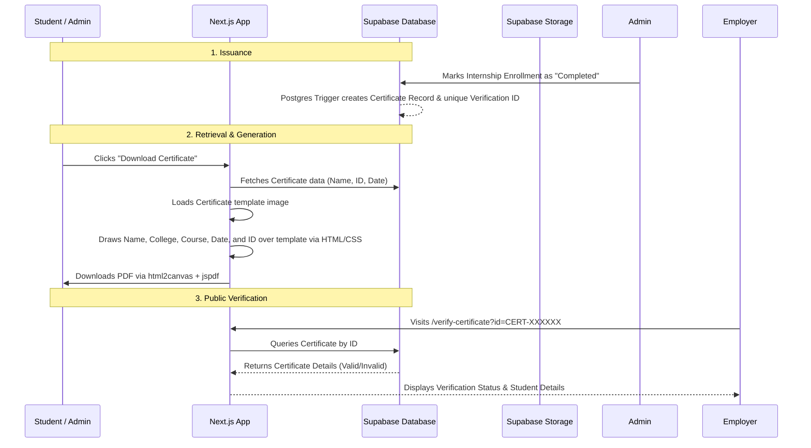

# Automated Certificate Generation & Verification System

This guide outlines how to build an fully automated certificate generation and verification system in your Next.js + Supabase application. Since you already have `jspdf` and `html2canvas` installed, you can generate certificates dynamically on the client side for free (without running an expensive server-side PDF generator).

---

## 1. System Architecture Flow

The following diagram illustrates how the automated certificate workflow operates:



---

## 2. Certificate Image Template Preparation
To automate the certificate generation, you will need a blank template image:
* **File Type:** High-resolution **PNG** or **JPG/JPEG** (recommended resolution: `1123px` x `794px` to match the landscape A4 aspect ratio).
* **Blank Spaces:** Use Photoshop or Canva to erase the student's name, college name, course, training dates, issues date, and certificate ID, leaving the spaces blank or with simple lines. All of these details will be positioned dynamically on top of the image via HTML/CSS.

---

## 3. Supabase Database Schema

To store certificate information and generate verification IDs automatically, run the following SQL migration in your Supabase SQL Editor. This will create a `certificates` table and a database function that automatically generates a unique, human-readable certificate number (e.g., `NLIT-2026-X7Y8Z9`).

```sql
-- 1. Create Certificates Table
CREATE TABLE public.certificates (
    id UUID PRIMARY KEY DEFAULT gen_random_uuid(),
    certificate_number VARCHAR(50) UNIQUE NOT NULL,
    student_id UUID NOT NULL REFERENCES auth.users(id) ON DELETE CASCADE,
    student_name VARCHAR(255) NOT NULL,
    college_name VARCHAR(255) NOT NULL,
    course_name VARCHAR(255) NOT NULL,
    duration_weeks VARCHAR(50) NOT NULL DEFAULT '04-WEEK',
    start_date DATE NOT NULL,
    end_date DATE NOT NULL,
    cin_number VARCHAR(100) NOT NULL DEFAULT 'U72900BR202XPTC062601',
    issue_date TIMESTAMP WITH TIME ZONE DEFAULT timezone('utc'::text, now()) NOT NULL,
    created_at TIMESTAMP WITH TIME ZONE DEFAULT timezone('utc'::text, now()) NOT NULL
);

-- Enable RLS (Row Level Security)
ALTER TABLE public.certificates ENABLE ROW LEVEL SECURITY;

-- 2. Create Policies
-- Everyone can read/verify certificates (publicly accessible for verification)
CREATE POLICY "Allow public read-only access for verification" 
ON public.certificates 
FOR SELECT 
USING (true);

-- Only admins can insert/update certificates (Modify auth.role() or metadata check based on your app architecture)
CREATE POLICY "Allow authenticated admins to insert certificates" 
ON public.certificates 
FOR INSERT 
WITH CHECK (true); -- Replace 'true' with admin check logic if you have an admin role system

-- 3. Automatic Certificate Number Generator Function
CREATE OR REPLACE FUNCTION generate_unique_certificate_number()
RETURNS TRIGGER AS $$
DECLARE
    new_cert_no VARCHAR(50);
    is_unique BOOLEAN := FALSE;
BEGIN
    -- Loop until we find a unique random code
    WHILE NOT is_unique LOOP
        -- Format: NLIT - [Current Year] - [6 Random Upper Case Letters/Digits]
        new_cert_no := 'NLIT-' || to_char(CURRENT_DATE, 'YYYY') || '-' || 
                       upper(substring(md5(random()::text) from 1 for 6));
        
        -- Check if it exists in DB
        SELECT NOT EXISTS(
            SELECT 1 FROM public.certificates WHERE certificate_number = new_cert_no
        ) INTO is_unique;
    END LOOP;
    
    NEW.certificate_number := new_cert_no;
    RETURN NEW;
END;
$$ LANGUAGE plpgsql;

-- 4. Create trigger to run before insertion
CREATE TRIGGER trigger_generate_certificate_number
BEFORE INSERT ON public.certificates
FOR EACH ROW
EXECUTE FUNCTION generate_unique_certificate_number();
```

---

## 4. React Component for Certificate Rendering (Absolute Positioning Layout)

This component takes the student's dynamic details, overlays them on your blank template background image, and exports a high-quality PDF using `html2canvas` and `jspdf`. It also generates a QR code dynamically to allow recruiters to scan and verify authenticity.

Create a component at `src/components/CertificateGenerator.tsx`:

```tsx
'use client';

import React, { useRef, useState } from 'react';
import html2canvas from 'html2canvas';
import jsPDF from 'jspdf';

interface StudentCertificateProps {
  studentName: string;
  collegeName: string;
  courseName: string;
  durationWeeks: string; // e.g., "04-WEEK"
  startDate: string; // e.g., "02/06/2025"
  endDate: string; // e.g., "29/06/2025"
  certificateId: string; // e.g., "NLIT-2026-X7Y8Z9"
  cinNumber: string; // e.g., "U72900BR202XPTC062601"
  issueDate: string; // e.g., "29/06/2025"
}

export default function StudentCertificate({
  studentName,
  collegeName,
  courseName,
  durationWeeks,
  startDate,
  endDate,
  certificateId,
  cinNumber,
  issueDate,
}: StudentCertificateProps) {
  const certificateRef = useRef<HTMLDivElement>(null);
  const [isDownloading, setIsDownloading] = useState(false);

  const handleDownload = async () => {
    if (!certificateRef.current) return;
    setIsDownloading(true);

    try {
      // Render the HTML to a canvas element at 3x resolution for high print quality
      const canvas = await html2canvas(certificateRef.current, {
        scale: 3, 
        useCORS: true, // Required for fetching background image securely
        logging: false,
      });

      const imgData = canvas.toDataURL('image/png');

      // Initialize landscape PDF
      const pdf = new jsPDF({
        orientation: 'landscape',
        unit: 'px',
        format: [canvas.width, canvas.height],
      });

      pdf.addImage(imgData, 'PNG', 0, 0, canvas.width, canvas.height);
      pdf.save(`Certificate_${studentName.replace(/\s+/g, '_')}.pdf`);
    } catch (err) {
      console.error('Error generating PDF:', err);
    } finally {
      setIsDownloading(false);
    }
  };

  return (
    <div className="flex flex-col items-center gap-6 p-4">
      {/* Scrollable Container for Mobile Devices */}
      <div className="w-full overflow-x-auto border border-gray-200 rounded-xl p-4 bg-gray-50">
        
        {/* Certificate layout box - Matches A4 landscape standard aspect ratio */}
        <div
          ref={certificateRef}
          className="relative select-none shadow-2xl mx-auto bg-white text-black font-sans"
          style={{
            width: '1123px',
            height: '794px',
            minWidth: '1123px',
            backgroundImage: `url('/images/blank-certificate-template.png')`, // Put your template image in public/images/
            backgroundSize: 'cover',
            backgroundPosition: 'center',
          }}
        >
          {/* Top-Left Info: CIN and Certificate ID */}
          <div className="absolute top-[12%] left-[10%] text-left text-sm font-semibold text-gray-800 space-y-1">
            <div>
              CIN: <span className="font-mono font-normal ml-1">{cinNumber}</span>
            </div>
            <div>
              CERTIFICATE ID: <span className="font-mono font-normal ml-1">{certificateId}</span>
            </div>
          </div>

          {/* Top-Right Info: Date */}
          <div className="absolute top-[12%] right-[10%] text-right text-sm font-semibold text-gray-800">
            DATE: <span className="font-mono font-normal ml-1">{issueDate}</span>
          </div>

          {/* Student Name */}
          <div className="absolute top-[41%] left-0 w-full text-center">
            <span className="text-3xl font-serif font-bold text-gray-800 border-b-2 border-dashed border-gray-400 px-8 pb-1">
              {studentName}
            </span>
          </div>

          {/* Dynamic Body Text */}
          <div className="absolute top-[49%] left-[10%] right-[10%] text-center px-4 leading-relaxed">
            <p className="text-md text-gray-700 font-medium">
              STUDENT OF <span className="font-bold text-black uppercase">{collegeName}</span> HAS SUCCESSFULLY COMPLETED {durationWeeks} ONLINE 
              TRAINING IN <span className="font-bold text-black uppercase">{courseName}</span> FROM <span className="font-semibold">{startDate}</span> TO <span className="font-semibold">{endDate}</span> WITH WONDERFUL REMARKS
            </p>
            <p className="text-sm font-bold text-gray-800 mt-2 tracking-wide">
              NEXGEN LEARNING INSTITUTE OF TECHNOLOGY
            </p>
            <p className="text-xs text-gray-600 mt-3 max-w-xl mx-auto leading-normal">
              DURING THIS PERIOD, THE INTERN SHOWED DEDICATION, ENTHUSIASM, AND APPLIED THEIR SKILLS THROUGH HANDS-ON EXPERIENCE AND REAL-WORLD PROJECTS
            </p>
          </div>

          {/* Bottom Middle: QR Code for Verification Scan */}
          <div className="absolute bottom-[6%] left-0 w-full flex flex-col items-center">
            
            <span className="text-[10px] font-mono text-gray-500 mt-1 uppercase">
              Scan to Verify
            </span>
          </div>

        </div>
      </div>

      <button
        onClick={handleDownload}
        disabled={isDownloading}
        className="px-8 py-3 bg-blue-600 hover:bg-blue-700 text-white font-medium rounded-lg shadow-md transition disabled:opacity-50"
      >
        {isDownloading ? 'Generating PDF...' : 'Download Certificate'}
      </button>
    </div>
  );
}
```

---

## 5. Step 4: Public Verification Page

Create a public verification route in Next.js where recruiters or students can check if a certificate is authentic.

Create a page at `src/app/verify/page.tsx`:

```tsx
'use client';

import React, { useState } from 'react';
import { createClient } from '@/utils/supabase/client'; // Replace with your supabase client import path

export default function VerifyCertificate() {
  const [certId, setCertId] = useState('');
  const [loading, setLoading] = useState(false);
  const [certificate, setCertificate] = useState<any>(null);
  const [searched, setSearched] = useState(false);
  const supabase = createClient();

  const handleVerify = async (e: React.FormEvent) => {
    e.preventDefault();
    if (!certId.trim()) return;

    setLoading(true);
    setSearched(true);
    setCertificate(null);

    try {
      const { data, error } = await supabase
        .from('certificates')
        .select('*')
        .eq('certificate_number', certId.trim().toUpperCase())
        .single();

      if (error) {
        console.error(error);
      } else {
        setCertificate(data);
      }
    } catch (err) {
      console.error(err);
    } finally {
      setLoading(false);
    }
  };

  return (
    <div className="min-h-screen bg-gray-50 flex flex-col items-center justify-center p-4">
      <div className="max-w-md w-full bg-white rounded-2xl shadow-xl p-8 border border-gray-100">
        <h1 className="text-2xl font-bold text-center text-gray-800 mb-2">
          Verify Internship Certificate
        </h1>
        <p className="text-sm text-center text-gray-500 mb-6">
          Enter the Verification ID listed on the certificate.
        </p>

        <form onSubmit={handleVerify} className="space-y-4">
          <input
            type="text"
            placeholder="e.g. NLIT-2026-X7Y8Z9"
            value={certId}
            onChange={(e) => setCertId(e.target.value)}
            className="w-full px-4 py-3 rounded-lg border border-gray-300 focus:ring-2 focus:ring-primary focus:outline-none uppercase text-center font-mono tracking-widest text-lg"
            required
          />
          <button
            type="submit"
            disabled={loading}
            className="w-full py-3 bg-blue-600 hover:bg-blue-700 text-white font-medium rounded-lg transition disabled:opacity-50"
          >
            {loading ? 'Verifying...' : 'Verify Authenticity'}
          </button>
        </form>

        {searched && !loading && (
          <div className="mt-8 pt-6 border-t border-gray-100 animate-fadeIn">
            {certificate ? (
              <div className="bg-emerald-50 text-emerald-800 p-4 rounded-xl border border-emerald-100 text-center">
                <div className="inline-flex items-center justify-center w-12 h-12 bg-emerald-100 rounded-full text-emerald-600 mb-3">
                  ✓
                </div>
                <h3 className="font-bold text-lg mb-1">Authentic Certificate</h3>
                <p className="text-sm text-emerald-700 mb-4">
                  This certificate was officially issued by NLITedu.
                </p>
                <div className="text-left space-y-2 text-sm bg-white p-4 rounded-lg border border-emerald-200">
                  <p><span className="text-gray-500">Student Name:</span> <strong className="text-gray-800">{certificate.student_name}</strong></p>
                  <p><span className="text-gray-500">College:</span> <strong className="text-gray-800">{certificate.college_name}</strong></p>
                  <p><span className="text-gray-500">Course:</span> <strong className="text-gray-800">{certificate.course_name}</strong></p>
                  <p><span className="text-gray-500">Issued On:</span> <strong className="text-gray-800">{new Date(certificate.issue_date).toLocaleDateString()}</strong></p>
                  <p><span className="text-gray-500">Certificate ID:</span> <strong className="text-gray-800 font-mono">{certificate.certificate_number}</strong></p>
                </div>
              </div>
            ) : (
              <div className="bg-rose-50 text-rose-800 p-4 rounded-xl border border-rose-100 text-center">
                <div className="inline-flex items-center justify-center w-12 h-12 bg-rose-100 rounded-full text-rose-600 mb-3">
                  ✗
                </div>
                <h3 className="font-bold text-lg mb-1">Invalid Certificate</h3>
                <p className="text-sm text-rose-700">
                  The provided Verification ID does not match any record in our database. Please check the spelling.
                </p>
              </div>
            )}
          </div>
        )}
      </div>
    </div>
  );
}
```
